# RitsIRC

This repository contains my solution to the final assignment for Ritsumeikan University’s 2025–2026 **53346 Network Systems** course.

RitsIRC is a mostly specification-compliant [Modern IRC](https://modern.ircdocs.horse/) client and server written in pure Java. **This is a toy project and is not intended for production use**. This project is not at all secure (SASL/TLS are not viable to configure in the context of this assignment), and has only been tested on macOS (although it should also work on Linux, it will not work on Windows due to the native `STTY` usage).

## Team Members

- Jesse Grabowski (2600230465-0)

## TLDR

### Running the Application

1. Build the application using `mvn clean package -DskipTests` (or `./mvnw clean package -DskipTests` if you don't have Maven installed)
2. Run the server using `java -cp target/irc-1.0.0-SNAPSHOT.jar com.jessegrabowski.irc.server.IRCServer -H <server IP> -L FINE` (`-H` must be correct for file transfers to work, but is optional for chatting)
3. Run the client using `java -cp target/irc-1.0.0-SNAPSHOT.jar com.jessegrabowski.irc.client.IRCClient <server IP>` (include `-n <nickname>` if you wish to use a custom nickname instead of a randomly generated one, include `-s` to enable the simple UI if the standard client does not work correctly on your system)

### Exercising the Application

1. Launch the server and at least two clients as shown above. Enter the following commands on at least one client.
2. `/connect` if not automatically connected
3. `/msg <nickname> <message>` to send a direct message to another user
4. `/send <nickname> <path>` to send a file to another user
5. `/accept <id>` to accept a file transfer from another user
6. `/join #test` to join a channel named `#test`
7. `/msg #test <message>` or enter text with no command if the channel is focused (prompt will be `[<nick>@<ip>/<focused channel>]`) to send a message to a channel

### Evaluating the Networking Code

1. Begin at `com.jessegrabowski.irc.network.IRCConnection` for the main IRC `Socket` code, shared by the server and client.
2. Next look at `com.jessegrabowski.irc.network.Acceptor` for the server-side `ServerSocket` listener code, including the acceptor loop.
3. Check out `com.jessegrabowski.irc.client.dcc.DCCDownloader` and `com.jessegrabowski.irc.client.dcc.DCCUploader` for the client-side file transfer code, and `com.jessegrabowski.irc.server.dcc.DCCRelayEngine` and `com.jessegrabowski.irc.server.dcc.DCCRelayPipe` for the server-side file transfer code.

### Evaluating the Protocol Code

1. Begin with `com.jessegrabowski.irc.protocol.model.IRCMessage` and a few of its subclasses for the message model.
2. Next look at `com.jessegrabowski.irc.protocol.IRCMessageUnmarshaller` for the main message parsing logic.
3. Finally look at `com.jessegrabowski.irc.protocol.IRCMessageMarshaller` for the main message serialization logic.

### Evaluating the Client

1. Begin at the entrypoint: `com.jessegrabowski.irc.client.IRCClient`
2. Check `com.jessegrabowski.irc.client.IRCClientEngine` for connection management and protocol handlers

### Evaluating the Server

1. Begin at the entrypoint: `com.jessegrabowski.irc.server.IRCServer`
2. Check `com.jessegrabowski.irc.server.IRCServerEngine` for connection management and protocol handlers

## Project Structure

RitsIRC is built using [Apache Maven](https://maven.apache.org/) and generally follows Maven’s standard project layout, with a few additional directories:

- **`doc/`**  
  Project documentation, primarily architecture descriptions and UML diagrams used in the final report.

- **`src/`**  
  Source code for the client and server implementations, along with supporting resources such as configuration files.

- **`test/`**  
  Testing and validation resources, including Docker configurations for third-party IRC servers (used for compatibility testing), modifications to `irctest` for specification compliance, and a simple performance test used for profiling.

## Setup and Building

This project requires **Java 25 or later** to build and run. Before building, ensure that:

* The `JAVA_HOME` environment variable points to your Java installation
* The `java --version` command reports a version starting with `25` (or newer)

The specific Java vendor does not matter. This project was developed using Microsoft’s OpenJDK distribution, but it should work with any compliant JDK.

```
% java --version
openjdk 25.0.1 2025-10-21 LTS
OpenJDK Runtime Environment Microsoft-12574220 (build 25.0.1+8-LTS)
OpenJDK 64-Bit Server VM Microsoft-12574220 (build 25.0.1+8-LTS, mixed mode, sharing)
```

In addition, ensure that **Apache Maven** is configured to use Java 25 or later. You can verify this with:

```
% mvn --version
Apache Maven 3.9.9 (8e8579a9e76f7d015ee5ec7bfcdc97d260186937)
Maven home: /opt/homebrew/Cellar/maven/3.9.9/libexec
Java version: 25.0.1, vendor: Microsoft, runtime: /Library/Java/JavaVirtualMachines/microsoft-25.jdk/Contents/Home
Default locale: en_US, platform encoding: UTF-8
OS name: "mac os x", version: "14.7.8", arch: "aarch64", family: "mac"
```

If you do not have maven installed, you can use the maven wrapper script included in this project instead. Simply replace all mentions of `mvn` with `./mvnw`.

For managing multiple Java versions on a single machine, I recommend using [jEnv](https://www.jenv.be/). When used with the Maven plugin enabled, jEnv will automatically detect the `.java-version` file in the project root and configure Maven to use the correct Java version.

To build the project and produce a JAR file, run:

```
mvn clean package -DskipTests
```

This will generate a `target/` directory containing a single JAR file named:

```
irc-<version>-SNAPSHOT.jar
```

Note that `-DskipTests` is used to skip running unit tests, as they slow down the build process and are not required for this assignment. If you're curious about how the tests work, you can omit this flag to run them, but I'd rather they be off for evaluation in case a network test decides to be flaky.

## Running

Both the client and server can be run using the `java` command, with the JAR file produced by Maven included on the classpath:

```
java -cp target/irc-1.0.0-SNAPSHOT.jar <main class>
```

### Server

To view a list of options supported by the server, run the following command (note the `--help` flag):

```
java -cp target/irc-1.0.0-SNAPSHOT.jar com.jessegrabowski.irc.server.IRCServer --help
Pure-Java IRC Server

Usage:
	java -cp [jarfile] com.jessegrabowski.irc.server.IRCServer [options] [args]

Options:
	-p, --port <value> : port of the IRC server (default 6667)
	-H, --host <value> : host name of the IRC server (default: auto-detected; not reliable behind NAT — configure explicitly for production)
	-l, --log-file <value> : log file pattern, supports %u and %g formats for rotation
	-L, --log-level <value> : log level, integer or j.u.l.Level well-known name
	-P, --password <value> : password for the IRC server
	-f, --ping-frequency <value> : client heartbeat frequency (ms)
	-i, --idle-timeout <value> : duration of inactivity before a client is considered dead (ms)
	-I, --isupport-properties <value> : location of RPL_ISUPPORT definitions (default classpath:/isupport.properties)
	-S, --server-name <value> : name of the irc server
	-o, --operator-name <value> : operator account name
	-O, --operator-password <value> : operator account password
	-N, --nickname-history <value> : maximum depth of nickname history (default 200)
	-M, --motd <value> : location of MOTD file (.txt)
	-D, --dcc-port <value> : port for DCC connections (default 49152-65535)
```

For the purposes of this assignment, the two most important flags are:

- `-H` / `--host`  
  The IP address or hostname at which the server should be accessible to clients. Automatic detection is unreliable, so this **must** be set explicitly for DCC file transfers to function correctly. Defaults to `127.0.0.1`.

- `-L` / `--log-level`  
  I recommend setting this to `FINE` to view incoming and outgoing raw IRC messages. Defaults to `INFO`.

To start the server for evaluation, run the following command (replacing `192.168.40.129` with the IP address of your machine):

```
java -cp target/irc-1.0.0-SNAPSHOT.jar com.jessegrabowski.irc.server.IRCServer -H 192.168.40.129 -L FINE
```

### Client

To view a list of options supported by the client, run the following command (note the `--help` flag):

```
java -cp target/irc-1.0.0-SNAPSHOT.jar com.jessegrabowski.irc.client.IRCClient --help
Pure-Java IRC Client

Usage:
	java -cp [jarfile] com.jessegrabowski.irc.client.IRCClient [options] [args]

Options:
	-p, --port <value> : port of the IRC server (default 6667)
	-r, --read-timeout <value> : idle timeout before closing connection (default 600000)
	-c, --connect-timeout <value> : timeout for establishing server connection (default 10000)
	-C, --charset <value> : charset used for communication with the server (default UTF-8)
	-s, --simple-ui : use non-interactive mode (no cursor repositioning or dynamic updates; required on some terminals)
	-n, --nickname <value> : nickname of the IRC user
	-R, --real-name <value> : real name of the IRC user
	-P, --password <value> : password for the IRC server
	-l, --log-file <value> : log file pattern, supports %u and %g formats for rotation
	-L, --log-level <value> : log level, integer or j.u.l.Level well-known name
	-m, --my-address <value> : public address to use for CTCP DCC

Positionals:
	arg0 (required) : hostname of the IRC server
```

For the purposes of this assignment, the two most important flags are:

- `-n` / `--nickname`  
  The nickname to use for the client. This will be your username on the IRC server and must be unique. Nicknames should be no more than 9 characters long; longer values will be truncated by the server. Defaults to `auto`, which generates a random nickname.

- `-s` / `--simple-ui`  
  Enables a simplified, non-interactive UI that avoids terminal-specific features. This mode does not support all client functionality and should only be used if the standard client cannot run correctly on your system.

Additionally, `arg0` specifies the hostname or IP address of the IRC server to connect to.

To start the client for evaluation, run the following command (replacing `192.168.40.129` with the IP address of your machine and `jesse` with your own nickname):

```
java -cp target/irc-1.0.0-SNAPSHOT.jar com.jessegrabowski.irc.client.IRCClient -n jesse 192.168.40.129
```

## Using the Application

### Getting Started

1. Launch the server and clients as described above. You may start them in any order; in this case I started the clients first to show what happens when a server cannot be found. If you start the server first, the clients will automatically connect to it.
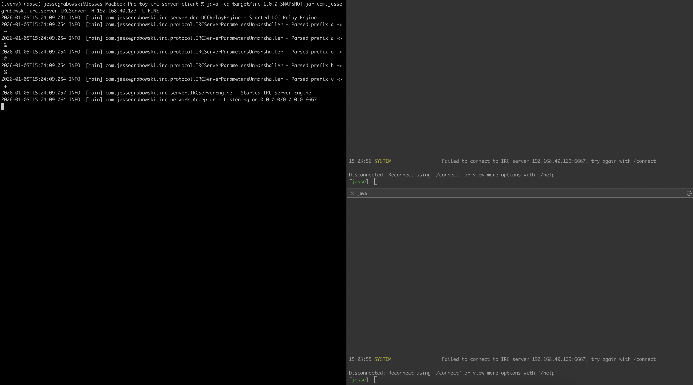

2. If a client does not connect to the server automatically, use `/connect` to try again.
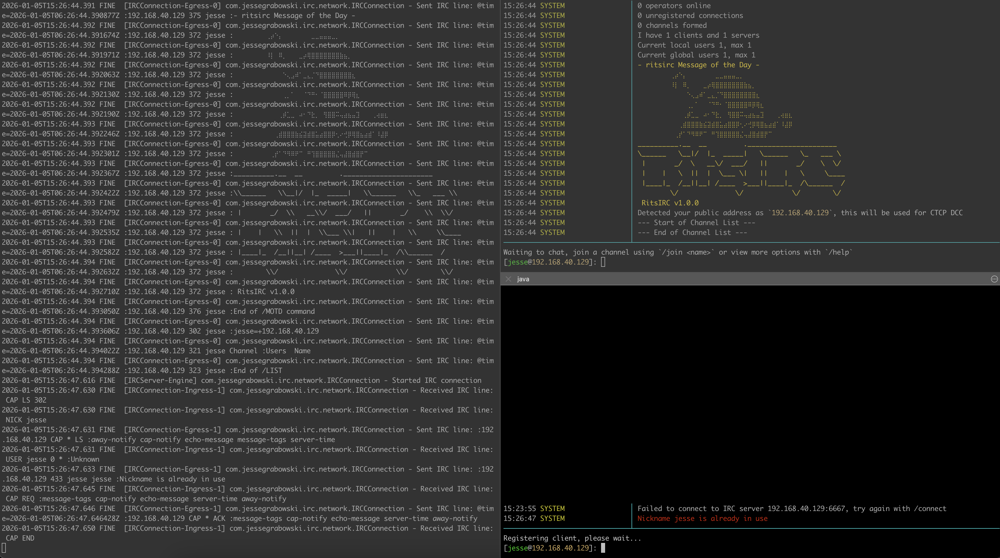

3. If you configure multiple clients to use the same nickname, you may see an error stating that your nickname is already in use. To fix this, select a new nickname using the `/nick <name>` command on the offending client. Note that this is temporary and will be reset when the client reconnects.
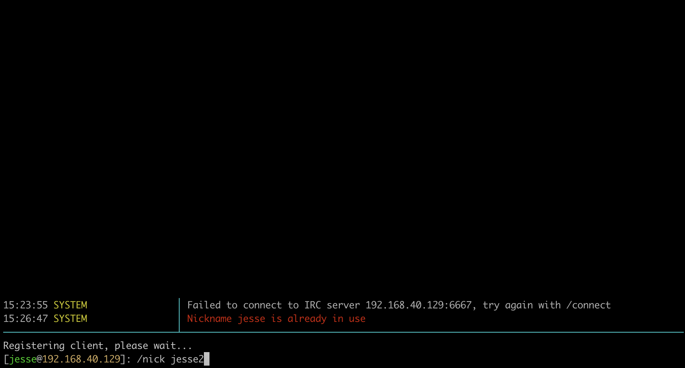

4. Once you are fully connected, you will receive some informational messages from the server, including statistics on connected clients, available channels (if any), and a message of the day (MOTD). This guide focuses on the criteria of the assignment, but you can view additional capabilities using the `/help` command.
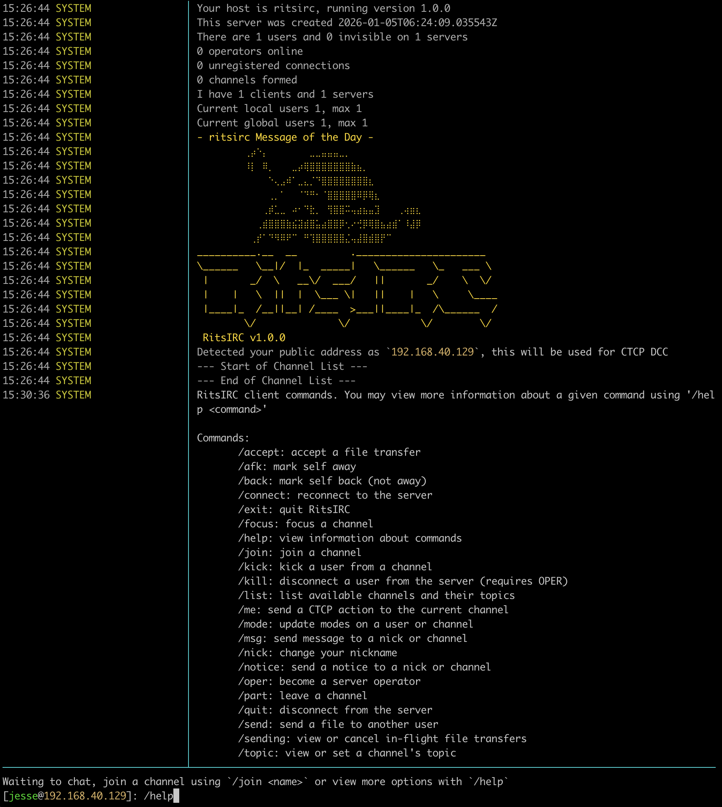

### Listing Users

To view a list of users currently connected to the server, use the `/who` command.

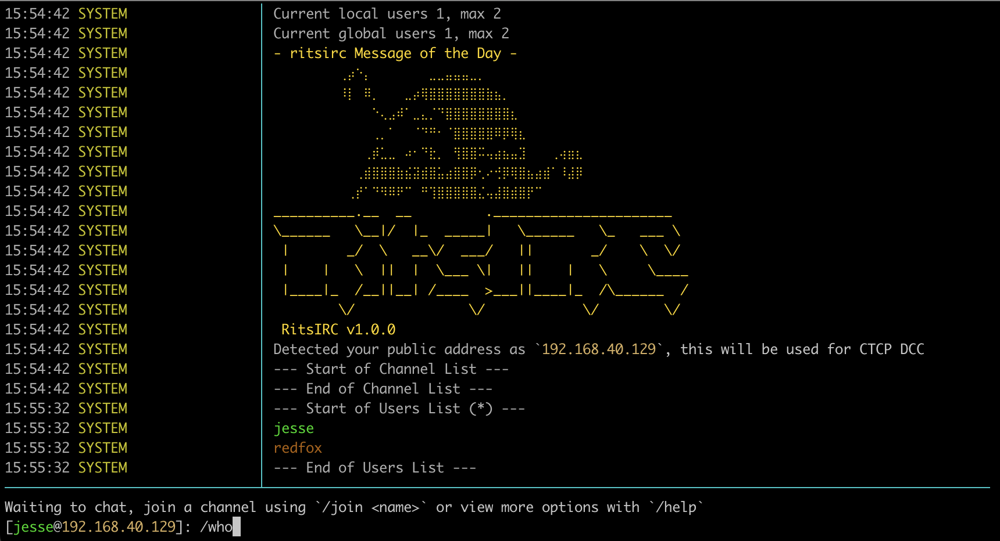

### Listing Channels

To view a list of channels currently available on the server, use the `/list` command. Note that channels are not created automatically, a user must first `/join` a channel for it to appear in the list.

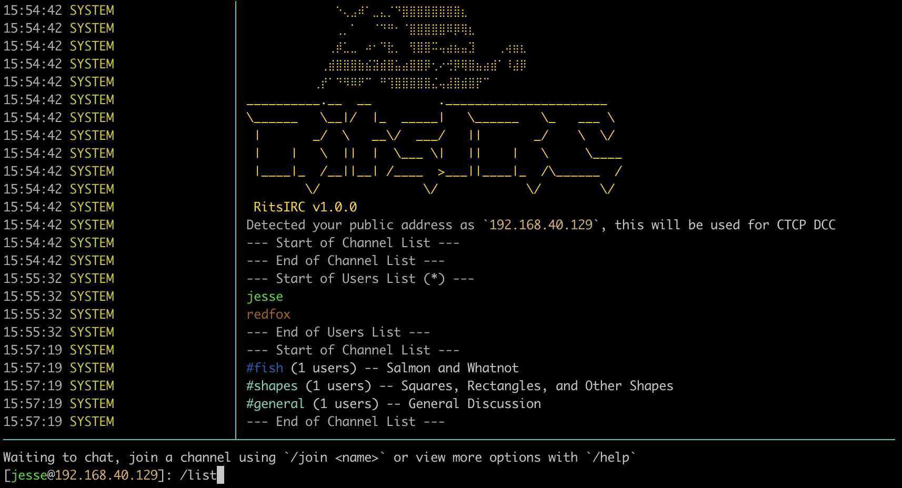

### Direct Messages

Direct messages can be sent between clients using the `/msg <nickname> <message>` command.

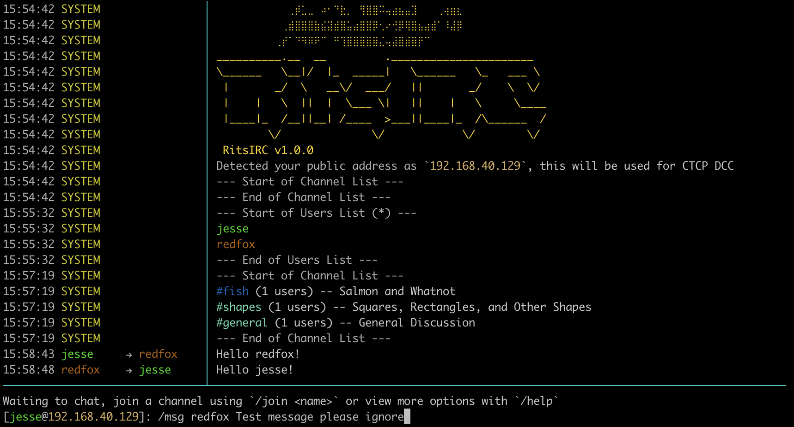

### Sending Files

Files can be sent between clients using the `/send <nickname> <path>` command. File paths resolve relative to the directory the client was launched from.

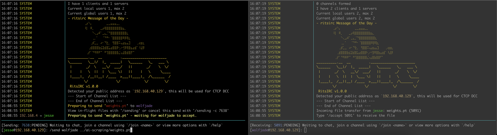

Upon initiating a send, both the sender and receiver will be given a numeric tracking ID that can be used to interact with the transfer (these numbers will likely be different for each client). To accept the transfer, the receiver should use the command `/accept <id>`.

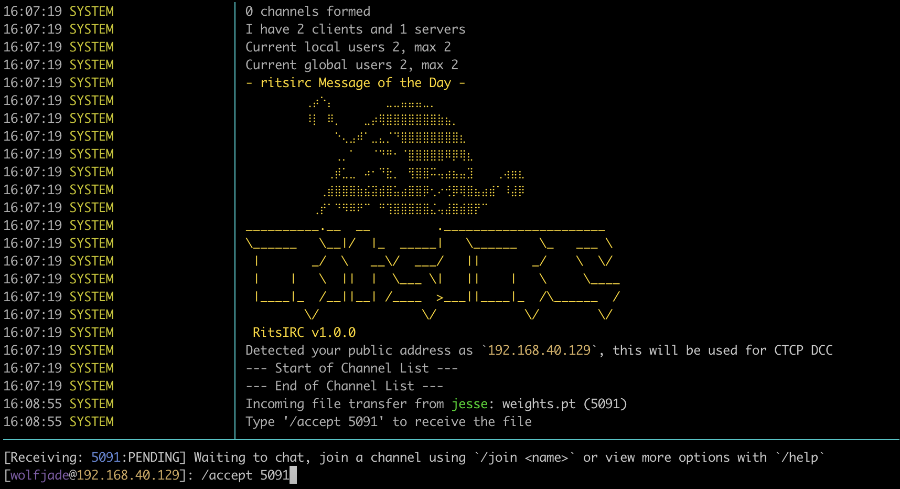

While small files will generally finish quite quickly, larger files may take longer to transfer. In those cases, both the sender and receiver will be able to view transfer progress in the status bar.

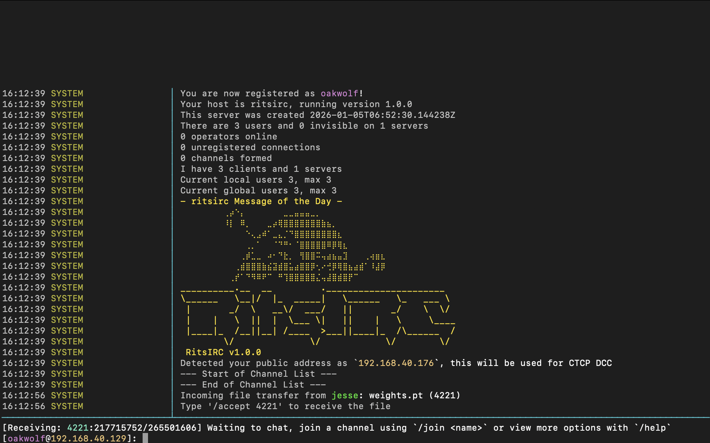

Upon completion, the sender will be shown a success message. The receiver will be given the path to the transferred file. By default, this will be placed into a `downloads` directory relative to the directory the client was launched from.

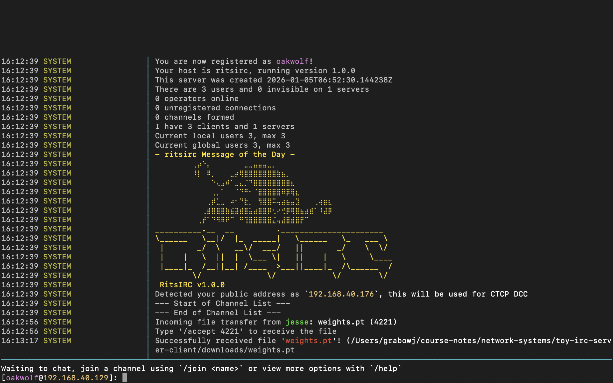

### Channels

Upon joining the server, a user will not be in any channels. If they wish to join or create one, they may do so using the `/join <channel>` command. Generally, IRC channels must begin with the prefix `#` or `&`, although this is server-dependent.

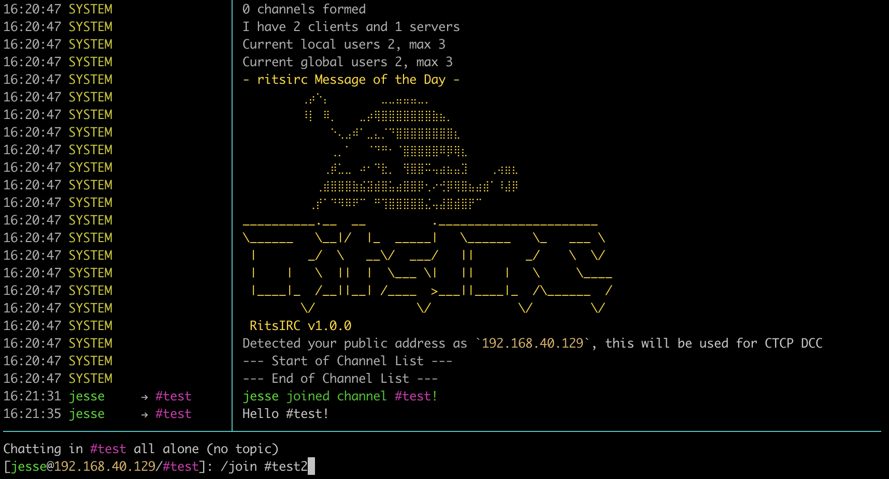

Doing so will cause the channel to be focused (shown in the prompt). Any text typed that isn't a valid command will be sent to the focused channel as if the user had typed `/msg <channel> <text>`.

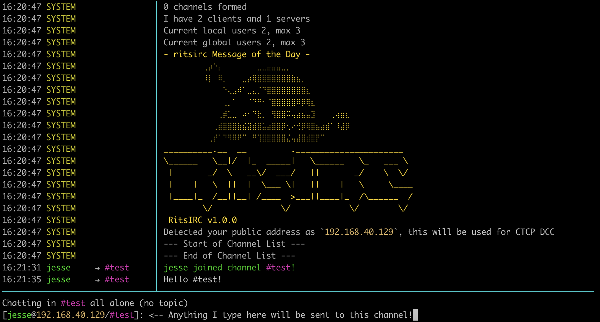

By default, a channel has no topic. A topic may be set by using `/topic <topic>` and the current topic may be viewed using `/topic`.

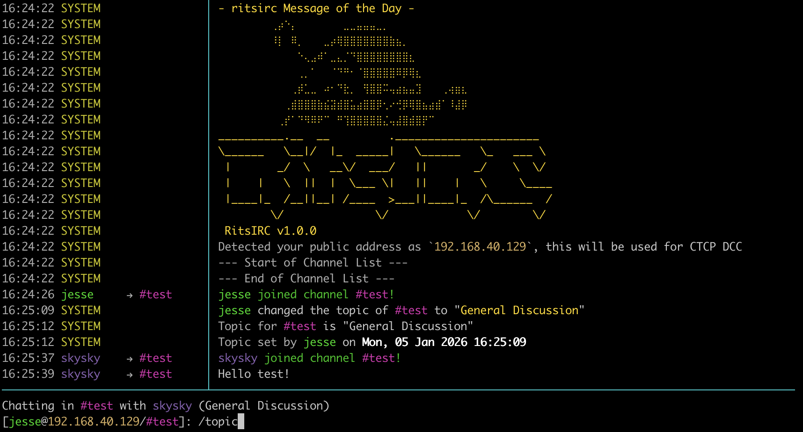

Users may focus a different channel using the `/focus <channel>` command.

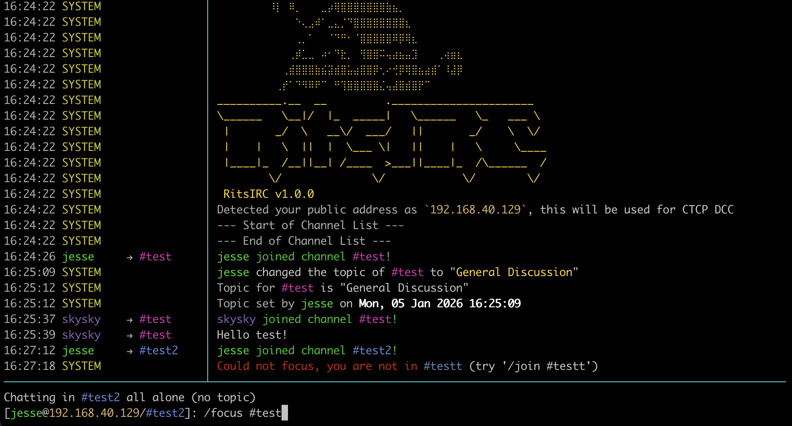

Finally, users may leave a channel using the `/part <channel>` command. This will cause the client to disconnect from the channel, and their focus will be set to the last channel they interacted with before it, if any.

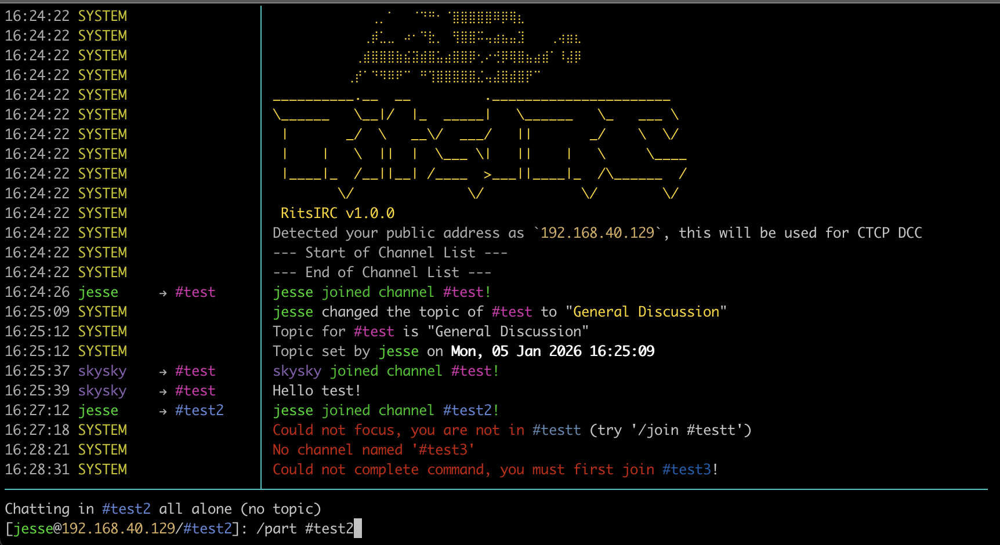

### Exiting the Server

Users may gracefully disconnect from the server using the `/quit` command, with an optional message (`/quit <message>`) that will be shown to any users that share a channel with them.

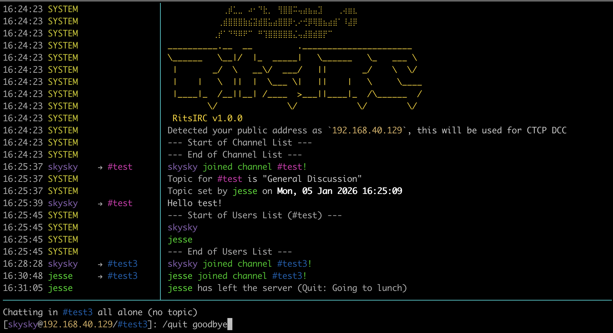

Finally, users may exit the client gracefully by using the `/exit` command. Both the client and server also handle JVM shutdown signals (`CTRL+C`); this is the expected way to close the server.

## Understanding the Code

As this application covers the entirety of the modern IRC specification, there is quite a bit of code that is not necessarily relevant to the assignment but is required for specific IRC features to work. To help with evaluation, this section will focus on the overall structure of the project and a suggested approach for understanding the code.

### Packages

This project utilizes a shared codebase for both the client and server, which can be found in the `src/main/java` directory. Each package has a defined purpose, which is outlined below.

#### com.jessegrabowski.irc.args

This package is responsible for parsing command-line arguments and converting them into a format suitable for consumption by the rest of the application. It is used both when starting the application and for interpreting user commands to the client. The most important class here is `ArgsParser`, everything else is used to support it.

#### com.jessegrabowski.irc.client

This package contains all of the client-specific logic for the application, including the main method for starting the client (`com.jessegrabowski.irc.client.IRCClient`).

#### com.jessegrabowski.irc.client.command

This package contains the logic for interpreting user commands, including a registry of `ArgsParser` instances that can be used to parse specific command arguments.

#### com.jessegrabowski.irc.client.command.model

This package contains Java classes representing each individual client command.

#### com.jessegrabowski.irc.client.dcc

This package contains the logic for handling DCC file transfers, including event definitions and a `DCCUploader` and `DCCDownloader` class for managing the transfer.

#### com.jessegrabowski.irc.client.tui

This package contains the logic for the client's text-based user interface.

#### com.jessegrabowski.irc.network

This package contains shared networking logic, including an acceptor loop for handling incoming socket connections (`ServerSocket` wrapper) and `IRCConnection`, a bidirectional stream abstraction for sending and receiving raw IRC messages.

#### com.jessegrabowski.irc.protocol

This package contains the logic for parsing raw IRC messages into Java objects (`IRCMessageUnmarshaller` and `IRCMessageMarshaller`), as well as some helper classes for dealing with generic IRC messages and some enums containing protocol-relevant concepts.

#### com.jessegrabowski.irc.protocol.dsl

This package contains a DSL for defining IRC messages to make the unmarshaller a bit easier to read.

#### com.jessegrabowski.irc.protocol.model

This package contains Java classes representing each individual IRC message type.

#### com.jessegrabowski.irc.server

This package contains all of the server-specific logic for the application, including the main method for starting the server (`com.jessegrabowski.irc.server.IRCServer`).

#### com.jessegrabowski.irc.server.dcc

This package contains the logic for relaying DCC file transfers through the server, including `DCCRelayEngine` for overall management.

#### com.jessegrabowski.irc.server.state

This package includes the application-level state of the server, including a registry of users, channels, and DCC transfers.

#### com.jessegrabowski.irc.util

This package contains various utility classes used throughout the application.

### Common Classes

#### com.jessegrabowski.irc.network.IRCConnection

This class works as a bidirectional channel for sending and receiving lines of IRC messages. It wraps a `Socket` and provides simple, non-blocking methods for interacting with it. This class wraps a pair of threads, one for sending (egress) which blocks on a queue until someone submits a message before sending it over the socket and repeating, and one for receiving (ingress) which blocks on the socket until a line is received before dispatching it to an `IRCIngressHandler` (which is implemented by `IRCClientEngine`). The `offer(String)` method is used to submit a message to the egress queue; it returns true if the message is accepted, or false if we've hit backpressure (which is less relevant for the client, but kills the connection on the server).

#### com.jessegrabowski.irc.protocol.model.IRCMessage

This is the base class for our Java representations of IRC messages. There are quite a few subclasses of this, but they are all very similarly structured, so I recommend looking at one or two of them to get a feel for the pattern and then ignoring the rest.

#### com.jessegrabowski.irc.protocol.IRCMessageMarshaller

This class is responsible for mapping an `IRCMessage` to a raw string suitable for sending over the network. Marshalling is fairly simple in this context, so this is mostly responsible for determining what order the fields of each Java type should be serialized in, with a few helper methods for edge cases like lists and optional values.

#### com.jessegrabowski.irc.protocol.IRCMessageUnmarshaller

This class is responsible for parsing a raw string into an `IRCMessage` instance. This class covers nearly 200 message types so it is quite long, but it utilizes a DSL from `com.jessegrabowski.irc.protocol.dsl` to allow the mappings to be written declaratively. Parsing a message looks something like:

```java
private IRCMessage004 parse004(Parameters parameters) throws Exception {
    return parameters.inject(
            required("client"),
            required("servername"),
            required("version"),
            required("available user modes"),
            required("available channel modes"),
            optional("channel modes with a parameter"),
            IRCMessage004::new);
}

private IRCMessage005 parse005(Parameters parameters) throws Exception {
    return parameters.inject(
            required("client"),
            greedyRequiredMap("tokens", this::splitToEntry),
            required("text"),
            IRCMessage005::new);
}
```

You'll note that any message type that has optional or non-string fields gets its own method, while the simpler method types are parsed in a large switch-expression at the top using `parseExact(~)`. The `Parameters` class wraps a simple `List<String>` of incoming fields and maps them to the correct type based on the arguments to `inject(~)`, filling fields from left to right and skipping any optional fields that are not present (i.e., each required field MUST claim one parameter, optional fields MAY claim one of there are any remaining, and greedy fields claim all remaining parameters. Optional fields are resolved on a first-come-first-served basis).

#### com.jessegrabowski.irc.args.ArgsParser

This class is responsible for parsing command-line arguments into type-safe properties objects. It is used by both the client and server for startup, as well as by the client for parsing runtime user commands.

### Client Walkthrough

This section will walk through the client's code, focusing on the parts that are especially relevant to the assignment.

#### com.jessegrabowski.irc.client.IRCClient

This class is the main entrypoint for the application. The main method parses command line arguments (Using `ArgsParser`) into an `IRCClientProperties` object, sets up logging, creates and starts the various components of the client (`TerminalUI`, `IRCClientEngine`, and `ClientCommandDispatcher`), and wires everything together.

#### com.jessegrabowski.irc.client.tui.TerminalUI

This is the abstract base class of both of our terminal implementations and gives an idea of what capabilities are available. Of note, the `TerminalInputHandler` abstraction is used to dispatch lines of user input to `ClientCommandDispatcher`. Also, it exposes methods to set the prompt, update the status bar, and print lines to the terminal. These methods work in terms of `RichString`s instead of regular strings, as we need a bit more functionality than what is provided by the standard library.

#### com.jessegrabowski.irc.client.tui.RichString

This class wraps a Java string but provides additional formatting information, such as a background or foreground color or a weight. It is used extensively throughout the client to display text in different colors and styles. It also contains some static utility methods mirroring the standard String class to make it easier to work with.

#### com.jessegrabowski.irc.client.command.ClientCommandDispatcher

This class is responsible for converting lines of user input into `IRCCommand` objects and dispatching them to `IRCClientEngine`. It does so using a registry of `ArgsParser` instances via `ClientCommandParser`.

#### com.jessegrabowski.irc.client.IRCClientEngine

This is the main brain of the client. 

The first method you'll want to look at is the constructor, which sets up the work queue (indirectly, as a `ScheduledExecutorService`). This also sets up our `StateGuard`, an abstraction used throughout the engine classes to ensure that state is only touched from a single thread.

Next, take a look at the `start()` method, which is called by the main method on startup. The interesting bit here is the call to `accept(ClientCommand)` with an instance of `ClientCommandConnect`, which is how the client does its automatic connection attempt at startup. We'll discuss how these commands are handled in a bit, but for now, you can treat this like a direct call to the `connect()` method.

The `connect()` method is responsible for establishing a connection to the server. It does so using the `IRCClientConnectionFactory` class, which is responsible for creating a `Socket` and wrapping it in our `IRCConnection` abstraction. Once we have a connection object, this method fires off a series of commands to register the client with the server and set up various capabilities using the `send(IRCMessage)` method.

Looking deeper at the `send(IRCMessage)` method, we can see that it simply marshals the message into a raw string and sends it using our `IRCConnection` abstraction.

```java
private boolean send(IRCMessage message) {
  return send(MARSHALLER.marshal(message));
}

private boolean send(String message) {
    IRCConnection connection = connectionHolder.get();
    if (connection == null) {
        return false;
    }
    return connection.offer(message);
}
```

Next, you'll want to take a look at `accept(ClientCommand)`, the method that handles incoming commands from the `ClientCommandDispatcher`. You'll notice that it immediately passes the command off to the `ScheduledExecutorService` for serialized execution of the `handle(ClientCommand)` method. Jumping down to there, you'll see a large switch-expression exhaustively covering all of the different command types; as this is using sealed interfaces, there is a compile-time check enforcing that every possible branch is covered. To understand how these are handled, let's take a quick look at the handler for `ClientCommandMsg`; the others are similar.

```java
private void handle(ClientCommandMsg command) {
    IRCClientState state = clientStateGuard.getState();
    if (state == null || engineState.get() != IRCClientEngineState.REGISTERED) {
        terminal.println(makeSystemErrorMessage("Could not send message -- connection not yet registered"));
        return;
    }

    send(new IRCMessagePRIVMSG(command.getTargets(), command.getText()));

    if (!state.getCapabilities().isActive(IRCCapability.ECHO_MESSAGE)) {
        for (String target : command.getTargets()) {
            terminal.println(
                    new TerminalMessage(LocalTime.now(), f(state.getMe()), f(target), s(command.getText())));
        }
    }
}
```

First, we check that our connection status is correct and show an error message if it isn't. Next, we send an IRC message to the server using `send(IRCMessage)` again, more or less directly passing the input as given by the user. Finally, we conditionally print a message to the terminal.

Finally, we need to understand how this class receives incoming messages from the server. `IRCConnection` calls `receive(IRCConnection, String)` each time a new line arrives, where it is immediately shifted over to the engine's thread. From there, it is parsed (as parsing requires state from the server) and dispatched via the `handle(IRCMessage)` method. Each message type (except for the simple, informational ones) has its own handler method. For example, here's the handler for a PRIVMSG command:

```java
private void handle(IRCMessagePRIVMSG message) {
    IRCClientState state = clientStateGuard.getState();
    if (state == null || engineState.get() != IRCClientEngineState.REGISTERED) {
        return;
    }

    LocalTime time = getMessageTime(message);
    for (String target : message.getTargets()) {
        terminal.println(new TerminalMessage(time, f(message.getPrefixName()), f(target), s(message.getMessage())));
    }

    state.touch(message.getPrefixName());
}
```

Once again, we begin by making sure we're fully connected. We then simply display the message as-is to the user, and update the last-active time for the sender.

Finally, file transfers involve a bit of additional logic beyond normal IRC processing. The methods of interest here are `handle(ClientCommandAccept)`, which is called when a user types `/accept <id>` and spawns a `DCCDownloader`, and `handle(IRCMessageCTCPDCCReceive)`, which is called when the receiver connects to the server's DCC relay and spawns a `DCCUploader`.

As there are quite a few handlers, here is a brief listing of the most relevant ones for the assignment:
- `handle(IRCMessageCTCPDCCSend)` - The receiver of a file transfer receives this message when the sender initiates the transfer. If they accept it, the transfer is done out of band using `DCCDownloader`.
- `handle(IRCMessageCTCPDCCReceive)` - The sender of a file transfer receives this message once the receiver accepts the transfer. This causes the transfer to be performed out of band using `DCCUploader`.
- `handle(IRCMessagePRIVMSG)` - This is called whenever a user receives a direct message, or when a channel the user is joined to receives a message.
- `handle(ClientCommandAccept)` - This is called when a user types `/accept <id>` and spawns a `DCCDownloader`. If all goes well, this will eventually lead to the transfer being completed and `handle(DCCClientDownloadCompletedEvent)` being called.
- `handle(ClientCommandConnect)` - This is called automatically at application startup, or when the user types the `/connect` command. This sets up a connection between the client and the server. If all goes well, this should eventually lead to `handle(IRCMessage001)` being called.
- `handle(ClientCommandExit)` - This is called when the user types `/exit` to gracefully shut down the client. If all goes well, this should result in `handle(IRCMessageERROR)` being called, as well as the termination of `IRCConnection`.
- `handle(ClientCommandJoin)` - This is called when the user types `/join <channel>` to join a channel. If all goes well, this should eventually lead to `handle(IRCMessageJOIN)` being called.
- `handle(ClientCommandMsg)` - This is called when the user types `/msg <nickname> <message>` to send a direct message to another user. If all goes well, this should eventually lead to `handle(IRCMessagePRIVMSG)` being called (if `echo-message` is negotiated, otherwise this will just print to the terminal itself).
- `handle(ClientCommandPart)` - This is called when the user types `/part <channel>` to leave a channel. If all goes well, this should eventually lead to `handle(IRCMessagePART)` being called.
- `handle(ClientCommandSend)` - This is called when the user types `/send <nickname> <path>` to initiate a file transfer. If all goes well, this should eventually lead to `handle(IRCMessageCTCPDCCReceive)` being called.

#### com.jessegrabowski.irc.client.dcc.DCCDownloader

This class is responsible for handling the receiving end of a file transfer. It's a relatively simple wrapper around a `Socket` that simply connects, reads as much as it needs to, then disconnects when the transfer is complete.

#### com.jessegrabowski.irc.client.dcc.DCCUploader

This class is responsible for handling the sending end of a file transfer. It's a relatively simple wrapper around a `Socket` that simply connects, writes the file as raw bytes, waits for an acknowledgement from the receiver, then disconnects.

### Server Walkthrough

This section will walk through the server's code, focusing on the parts that are especially relevant to the assignment.

#### com.jessegrabowski.irc.server.IRCServer

This class is the main entrypoint for the application. The main method parses command line arguments (Using `ArgsParser`) into an `IRCServerProperties` object, sets up logging, creates and starts the various components of the server (`IRCServerEngine`, `DCCRelayEngine`, and an `Acceptor`), and wires everything together.

#### com.jessegrabowski.irc.network.Acceptor

This class wraps a ServerSocket and handles incoming connections using an `accept()` loop. When `Acceptor` receives a connection, it simply passes the `Socket` off to a `Dispatcher` instance, blocking the thread until the `Dispatcher` returns. `IRCServerEngine` is one such implementation (for IRC connections), and `DCCRelayEngine` has an internal lambda that also implements this interface (for file transfers).

#### com.jessegrabowski.irc.server.IRCServerEngine

This is the main brain of the client.

The first method you'll want to look at is the constructor, which sets up the work queue (indirectly, as a `ScheduledExecutorService`). This also sets up our `StateGuard`, an abstraction used throughout the engine classes to ensure that state is only touched from a single thread.

Next, look at `dispatch(Socket)`, which is called by the `Acceptor` when a new connection is received. This is responsible for creating a new `IRCConnection` instance and registering it with the server state. It also binds `onDisconnect(IRCConnection)` and `receive(IRCConnection, String)` to the connection so that they can be used later.

`onDisconnect(IRCConnection)` is called when the connection is closed, either erroneously or intentionally, and is responsible for removing the connection and its associated user from the server state.

`receive(IRCConnection, String)` is called whenever a line of text is received from the connection, and is responsible for parsing the raw string into an `IRCMessage` and dispatching it to the appropriate handler.

`handle(IRCConnection, IRCMessage)` is the main handler for incoming messages from the client. This does not make use of exhaustive pattern matching, as the server has no reasonable way to respond to most message types beyond logging them (see the `default` branch). This is otherwise very similar to the client's implementation. The following handlers are particularly relevant to the assignment:
- `handle(IRCConnection, IRCMessageCTCPDCCSend)` - This handler checks incoming DCC sends (file transfers) to determine if they're active (non-zero port) or passive (zero port). It rewrites passive sends to active sends originating from the server (to the receiver) and receives originating from the receiver (to the sender). It also notifies `DCCRelayEngine` of the new transfer (see `onEvent(DCCServerEvent)` for further interactions)
- `handle(IRCConnection, IRCMessageJOINNormal)` - This handler attempts to add a client to a channel, if they are permitted to join.
- `handle(IRCConnection, IRCMessageLIST)` - This handler responds to the `/list` command by sending a list of all channels to the client.
- `handle(IRCConnection, IRCMessagePART)` - This handler attempts to remove a client from a channel.
- `handlePrivmsg(IRCConnection, ~)` - This is a general-purpose handler for `PRIVMSG` (`/msg` command), `NOTICE`, and `TAGMSG`. It takes an incoming message, determine if it is allowed to be routed to its targets, and then forwards it on to each relevant party, applying filtering or capability checks as necessary.

Finally, we have the `onEvent(DCCServerEvent)` method, which is responsible for mapping DCC events to changes to IRC state (and IRC messages when necessary). This method, and the handlers it delegates to, handle the bulk of the orchestration logic for file transfers on the server.

#### com.jessegrabowski.irc.server.dcc.DCCRelayEngine

This class is responsible for joining two clients together when they initiate a file transfer. Because DCC SEND does not include any sort of unique identifier or token, we instead need to open a new server port for each sender or receiver to connect to. This class is responsible for managing those ports (by managing `Acceptor` instances) and ensuring that they are properly cleaned up when the transfer is complete. It also provides a dynamic `Dispatcher` implementation that blocks until both clients connect, then joins them into a full-duplex channel.